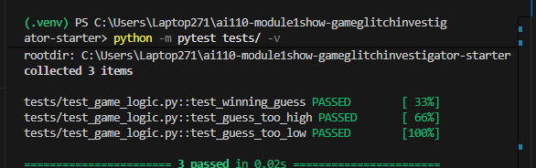

# 🎮 Game Glitch Investigator: The Impossible Guesser

## 🚨 The Situation

You asked an AI to build a simple "Number Guessing Game" using Streamlit.
It wrote the code, ran away, and now the game is unplayable. 

- You can't win.
- The hints lie to you.
- The secret number seems to have commitment issues.

## 🛠️ Setup

1. Install dependencies: `pip install -r requirements.txt`
2. Run the broken app: `python -m streamlit run app.py`

## 🕵️‍♂️ Your Mission

1. **Play the game.** Open the "Developer Debug Info" tab in the app to see the secret number. Try to win.
2. **Find the State Bug.** Why does the secret number change every time you click "Submit"? Ask ChatGPT: *"How do I keep a variable from resetting in Streamlit when I click a button?"*
3. **Fix the Logic.** The hints ("Higher/Lower") are wrong. Fix them.
4. **Refactor & Test.** - Move the logic into `logic_utils.py`.
   - Run `pytest` in your terminal.
   - Keep fixing until all tests pass!

## 📝 Document Your Experience

- [ ] Describe the game's purpose.
- [ ] Detail which bugs you found.
- [ ] Explain what fixes you applied.

The game is a number guessing game built with Streamlit where players select a difficulty level (Easy, Normal, Hard) to set the range (e.g., 1-20 for Easy), then guess the secret number. It provides hints ("Go HIGHER!" or "Go LOWER!") to guide players, tracks attempts and score, and allows starting a new game.

Bugs found included reversed hints where guessing too high said "Go HIGHER!" instead of "Go LOWER!", and vice versa, affecting both normal guesses and edge cases with string comparisons. The New Game button only reset attempts and secret (hardcoded to 1-100), but didn't clear status, history, or score, preventing a fresh start. Additionally, the secret number changed on every submit due to Streamlit reruns, a state management issue.

Fixes applied involved correcting hint messages in `check_guess()` for both int-int and int-string comparisons. The function was refactored from `app.py` to `logic_utils.py` for better organization. The New Game button was updated to reset all session state and use the difficulty-based range. Pytest tests were modified to verify hint messages, and # FIX comments were added to document AI collaboration.

## 📸 Demo

## 🚀 Stretch Features

- [ ] [If you choose to complete Challenge 4, insert a screenshot of your Enhanced Game UI here]
